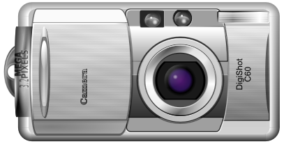

# PlutoSVG
plutosvg is a tiny SVG rendering library in C

## Features
- Basic Shapes : rect, circle, ellipse, line, polyline, polygon, path
- Paint Servers : solidColor, linearGradient, radialGradient, pattern(TODO)
- Document Structures: defs, svg, g, use, symbol
- Texts (TODO) : text, tspan, tref
- Image (TODO)

## Example
```c
#include <plutosvg.h>

#include <stdlib.h>
#include <stdio.h>

int main(void)
{
    plutovg_surface_t* surface = plutosvg_load_from_file("camera.svg", NULL, 0, 0, 96.0);
    if(surface == NULL)
    {
        printf("Load failed\n");
        return -1;
    }

    plutovg_surface_write_to_png(surface, "camera.png");
    plutovg_surface_destroy(surface);
    return 0;
}

```

output :



## Build
Install [cmake](https://cmake.org/download/) if not already installed

```
git clone --recursive https://github.com/sammycage/plutosvg.git
cd plutosvg
mkdir build
cd build
cmake ..
make
```

## Support
If you like what we do, [you can buy us a coffee](https://www.buymeacoffee.com/sammycage)
